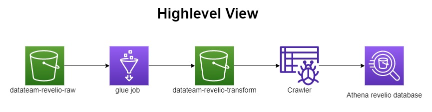
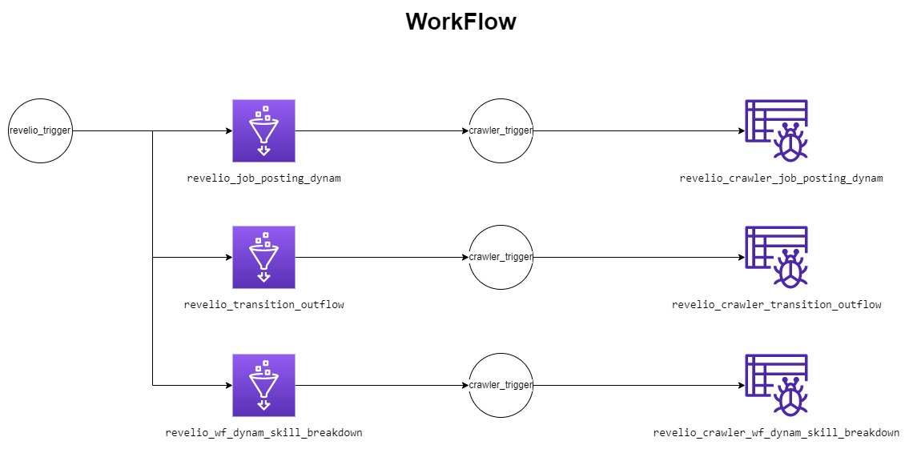

# revelio_project 
**Authors**\
`Team Lead`: Soumil Shah \
`Developers`: Rajesh Patidar, Divyansh Patel

**Description**\
In this project we will be creating a job which will read the data from S3 bucket from specific folder and load it to another S3 bucket. the data that we are dealing here is of revelio. To carry out this project we have used a AWS glue job, crawlers and workflow.

## Owerview

## work flow diagram

